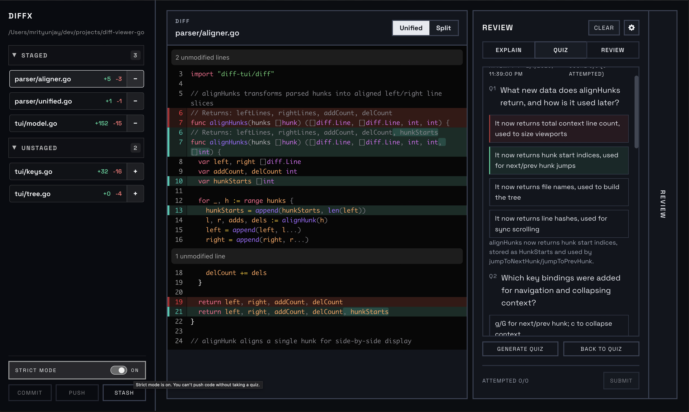

# diffx

A real-time git diff viewer with AI-powered code review, commit message generation, and interactive quizzes. Watch your repository changes live in a split/unified view while getting AI assistance for understanding and reviewing code.



## How to Run

```bash
# Install dependencies
bun install

# Create .env file
echo "DIFF_REPO_PATH=/path/to/your/repo" > .env
echo "OPENAI_API_KEY=your-openai-key" >> .env

# Start backend (terminal 1)
bun run dev:core

# Start frontend (terminal 2)
bun run dev
```

Open http://localhost:5173 in your browser.

## Demo Steps

### Basic Diff Viewing
1. Make changes to files in your watched repository
2. See files appear in the left sidebar under "Unstaged" or "Staged"
3. Click a file to view its diff in split or unified mode
4. Use +/- buttons to stage/unstage files

### AI Code Review
1. Make some code changes in your repo
2. Click the "Review" tab in the right panel
3. Click "Run Code Review" to get feedback from Bug Hunter, Security, and Quality agents
4. View findings sorted by severity (critical, warning, info)

### Auto-Generate Commit Message
1. Stage some files using the + button
2. Click "Commit" in the sidebar
3. Click "Auto-generate" to create an AI-powered commit message
4. Edit if needed, then click "Commit"

### Strict Mode (Quiz-Gated Commit/Push)
1. Toggle "Strict Mode" on in the sidebar
2. Generate and submit a quiz for the current diff
3. Commit/push are enabled only if a quiz exists for the exact diff state (diff hash)
4. If the diff changes, take a new quiz before committing or pushing

### Explain Changes
1. Select a file with changes
2. Click "Explain" tab in the right panel
3. Ask a question like "What does this change do?"
4. Get an AI-powered explanation

### Stash Changes
1. Make some changes in your repo
2. Click "Stash All" in the sidebar
3. Confirm to stash all changes (staged + unstaged)
